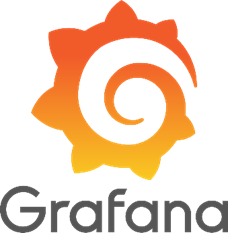
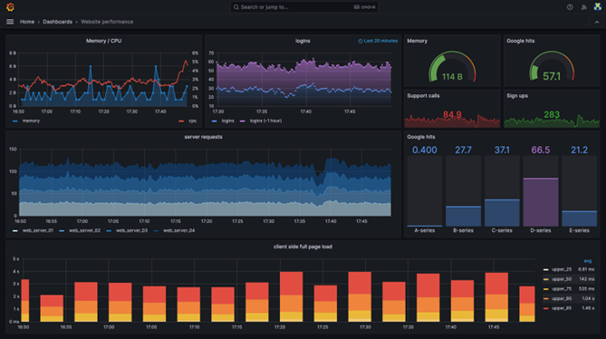
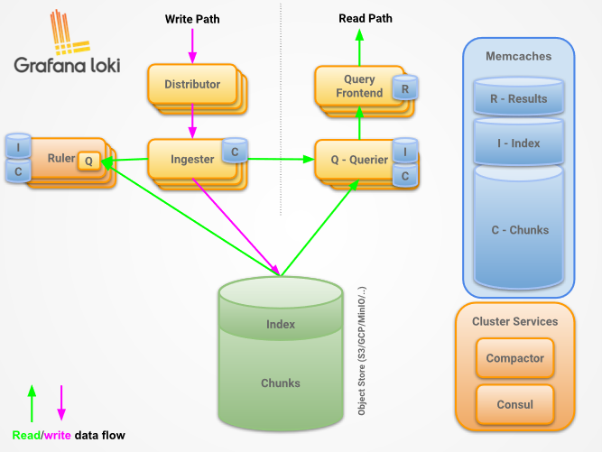
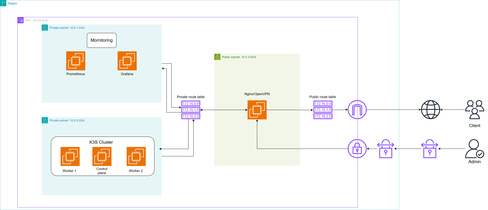

### Monitoring K3s - OpenWhisk Cluster with Prometheus, Grafana & Icinga

<h6> Đây là đồ án môn hệ Đánh giá hiệu năng hệ thống máy tính - NT531. Hệ thống được triển khai giúp giải quyết một số vấn đề thực tiễn quan trọng trong việc giám sát và quản lý hiệu suất của các cụm Kubernetes, và có sự tích hợp với Apache Openwhisk.

### Mornitoring Tools

<ol>
  <li><strong>Prometheus </strong></li>
  
  

  
  

<strong>Prometheus</strong> là một bộ công cụ mã nguồn mở dành cho giám sát hệ thống và cảnh báo. <strong>Prometheus</strong> thu thập và lưu trữ dữ liệu dưới dạng chuỗi thời gian, tức là mỗi thông tin về số liệu (<strong>metrics</strong>) sẽ được lưu kèm theo dấu thời gian ghi nhận, cùng với các cặp khóa - giá trị (<strong> labels</strong>) tùy chọn.

  <li><strong>Grafana</strong></li>

  

  
  

  

  
  

<strong>Grafana</strong> là một visualizer thể hiện các metrics thu thập từ nhiều nguồn như <strong>Prometheus</strong>, <strong>InfluxDB</strong>, <strong>Elasticsearch</strong>, <strong>MySQL</strong>, <strong>PostgreSQL</strong>,...dưới dạng các biểu đồ (<strong>chart</strong>) hoặc đồ thị (<strong>grap</strong>), được tập hợp lại thành dashboard có tính tùy biến cao, giúp dễ dàng theo dõi trạng thái của các node (<strong>CPU, RAM, DISK,...</strong>), trạng thái và thông tin về các dịch vụ (<strong>Nginx, OpenVPN, K8s, K3s</strong>),...

  <li><strong>Grafana Loki</strong></li>

  

  
  

<strong>Grafana Loki</strong> là một hệ thống logging được tối ưu hóa cho việc lưu trữ và truy vấn log theo các hiệu quả, tương tự như cách <strong>Prometheus</strong> xử lý <strong>metrics</strong>. Nó được phát triển bởi <strong>Grafana Labs</strong> và đặc biệt phù hợp với các hệ thống <strong>container</strong> như <strong>Kubernetes</strong>.

  <li><strong>AlerManager</strong></li>
  <strong>Aler Manager</strong> là một thành phần chính của <strong>Prometheus</strong>, có nhiệm vụ làm cấu nối giữa <strong>Prometheus</strong> và các ứng dụng hoặc hệ thống không hỗ trợ xuất <strong>metric</strong> theo định dạng của <strong>Prometheus</strong>
</ol>

### Tổng quan hệ thống

  

  
  

<strong>Hệ thống đề xuất gồm 3 vùng mạng</strong>

- Vùng mạng 10.0.1.0/24: đây là nơi đặt các máy ảo chịu trách nhiệm về giám sát hệ thống báo gồm Prometheus, Grafana, Grafana Loki, AlerManager.
- Vùng mạng 10.0.2.0/24: đây được xem như backend của hệ thống. Tại đây cài đặt một nền tảng mã nguồn mở là Apache OpenWhisk được cài đặt trên một cụm K3S.
  Vùng mạng 10.0.3.0/24: tại đây sẽ dựng lên một máy ảo cài đặt các dịch vụ như OpenVPN và Nginx. Ở đây đặt 1 trang web đơn giản có chức năng convert số từ hệ thập phân sang các hệ khác và ngược lại. Đây là nơi người dùng sẽ tương tác chính. Và admin muốn vào các vùng mạng private thì cần kết nối VPN đến và ssh và các máy bên trong.

<strong>Mô tả hệ thống </strong>

- Máy ảo ở vùng màn 10.0.3.0/24 sẽ chịu trách nhiệm chạy trang web để phục vụ cho người dùng. Các request đến trang web sẽ được Nginx chuyển tiếp đến các máy ở vùng mạng 10.0.2.0/24 đóng vai trò backend xử lý các request và trả về kết quả. Việc này giúp bảo mật vì không thể tương tác trực tiếp với backend và tránh quá tải phần backend của hệ thống. Dịch vụ OpenVPN dành cho admin muốn truy cập vào các máy bên trong để xem các dashboard của gafana, tạo các API,...
- Các máy ở vùng mạng 10.0.2.0/24 là nơi xử lý chính các request, cung cấp các API từ các hàm thông qua nền tảng OpenWhisk để Nginx có thể gọi đến.
- Các máy ở vùng mạng 10.0.1.0/24 sẽ chịu trách nhiệm giám sát và hiển thị dữ liệu thu thập.
